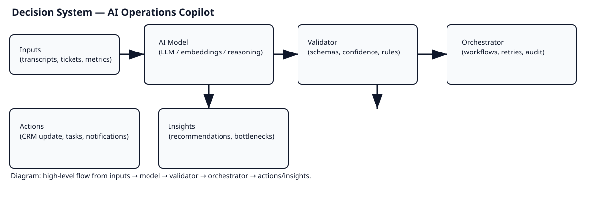

[](https://github.com/krishnarawatsf/ai-operations-copilot/actions)
[](https://github.com/krishnarawatsf/ai-operations-copilot/blob/main/LICENSE)
[](https://github.com/krishnarawatsf/ai-operations-copilot/releases)
[](https://codecov.io/gh/krishnarawatsf/ai-operations-copilot)
[](https://github.com/krishnarawatsf/ai-operations-copilot/network/alerts)

# AI Operations Copilot



AI Operations Copilot is a production-style portfolio project for AI automation, product operations, and workflow intelligence. It is designed to feel like an internal operations platform for a startup: it summarizes meetings, extracts action items, generates workflows, updates CRM systems, and surfaces bottlenecks before work slips.

## Why this project stands out
- It is an AI-native operations system, not a generic chatbot.
- The architecture is modular across frontend, backend, automation, and persistence layers.
- The AI layer is provider-agnostic and can support OpenAI or Claude.
- The project is built for demos, interviews, and internship evaluation.

## Tech Stack
- Frontend: React, TypeScript, TailwindCSS, Vite
- Backend: FastAPI, Python, SQLAlchemy, Pydantic
- Database: PostgreSQL
- AI: OpenAI API or Claude API
- Automation: n8n
- Testing: Pytest, Jest
- Deployment: Vercel + Railway or Render

## Core Features
- AI meeting intelligence: summarize meetings, extract action items, identify deadlines, assign owners, and generate follow-up summaries.
- AI workflow automation: generate workflows dynamically and trigger task or CRM updates.
- Operational dashboard: pending work, bottlenecks, productivity insights, and operational metrics.
- AI recommendations: detect inefficiencies and suggest automation opportunities.
- Notifications: Slack and email reminders with escalation handling.

## Folder Structure
- `frontend/`: React dashboard and component system.
- `backend/`: FastAPI application, services, schemas, and tests.
- `automation/`: n8n workflow blueprints.
- `database/`: SQL schema, migrations, and seed data.
- `docs/`: architecture, AI workflow design, testing strategy, and case study content.
- `tests/`: integration and contract scenario documentation.
- `scripts/`: local bootstrap and seed helpers.

See [docs/PROJECT_STRUCTURE.md](docs/PROJECT_STRUCTURE.md) for a file-by-file explanation.

## Local Setup
1. Copy `.env.example` to `.env` and fill in real secrets.
2. Create a Python virtual environment and install backend dependencies.
3. Install frontend dependencies with npm.
4. Start PostgreSQL and Redis with Docker Compose.
5. Run the backend and frontend in separate terminals or through VS Code tasks.

### Backend
```bash
python -m venv .venv
source .venv/bin/activate
pip install -r requirements.txt
python -m uvicorn backend.app.main:app --reload --app-dir backend
```

### Frontend
```bash
cd frontend
npm install
npm run dev
```

### Docker
```bash
docker compose up --build
```

## API Surface
- `GET /api/v1/health`
- `POST /api/v1/auth/login`
- `POST /api/v1/auth/refresh`
- `POST /api/v1/meetings/summarize`
- `POST /api/v1/meetings/follow-up`
- `POST /api/v1/workflows/generate`
- `POST /api/v1/workflows/crm-update`
- `GET /api/v1/dashboard/overview`
- `GET /api/v1/recommendations`
- `POST /api/v1/notifications/send`
- `POST /api/v1/webhooks/ingest`

## AI Workflow Design
The AI layer uses structured prompts, typed response contracts, and validation before persistence. The strategy is documented in [docs/ai-workflows.md](docs/ai-workflows.md).

### Reliability principles
- Validate outputs with Pydantic schemas.
- Retry transient provider errors with backoff.
- Keep prompts grounded in source data only.
- Use fallback summaries when the model fails.
- Store confidence and rationale for recommendations.

## Testing
Backend API tests live in `backend/app/tests/` and frontend tests live in `frontend/src/tests/`.

Examples covered:
- health checks
- meeting summarization
- workflow generation
- malformed input handling
- dashboard rendering
- response contract validation

See [docs/testing.md](docs/testing.md) for the full strategy.

## Database Design
The PostgreSQL schema stores meetings, workflows, tasks, recommendations, and notifications. See `database/schema/0001_initial.sql` for the canonical schema.

## Security and Deployment
- Security posture: [docs/security.md](docs/security.md)
- Deployment guide: [docs/deployment.md](docs/deployment.md)

## Automation
n8n workflow blueprints are stored in `automation/workflows/` and are designed to receive webhook payloads from the backend.

## Implementation Roadmap
1. Connect the backend services to real database persistence.
2. Replace the mock AI layer with provider adapters and prompt templates.
3. Wire n8n workflows to webhook endpoints.
4. Add auth and role-based access.
5. Add observability dashboards and alerting.
6. Deploy frontend to Vercel and backend to Railway or Render.

## Resume-Ready Summary
AI Operations Copilot is a startup-grade AI automation platform that transforms meeting transcripts, task queues, and workflow events into structured execution. It demonstrates product thinking, backend architecture, workflow automation, and AI system design.

## Recruiter Talking Points
- This project is built like a real product, not a toy demo.
- It separates AI orchestration from API transport and persistence.
- It shows how to reduce operational drag with structured automation.
- It is relevant to AI Automation, Product Ops, Workflow Automation, and AI Product Strategy roles.

## Case Study
See [docs/case-study/README.md](docs/case-study/README.md) for the product story and interview narrative.
