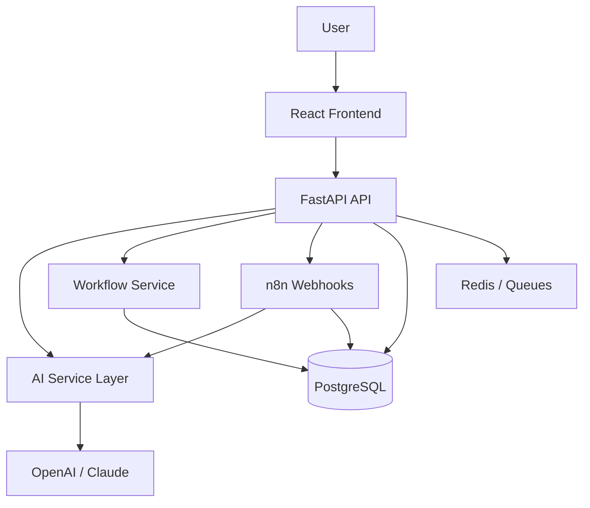

```mermaid
graph TD
  U[User] --> F[React Frontend]
  F --> A[FastAPI API]
  A --> S[AI Service Layer]
  A --> W[Workflow Service]
  A --> N[n8n Webhooks]
  S --> O[OpenAI / Claude]
  W --> P[(PostgreSQL)]
  A --> P
  A --> R[Redis / Queues]
  N --> S
  N --> P
```
